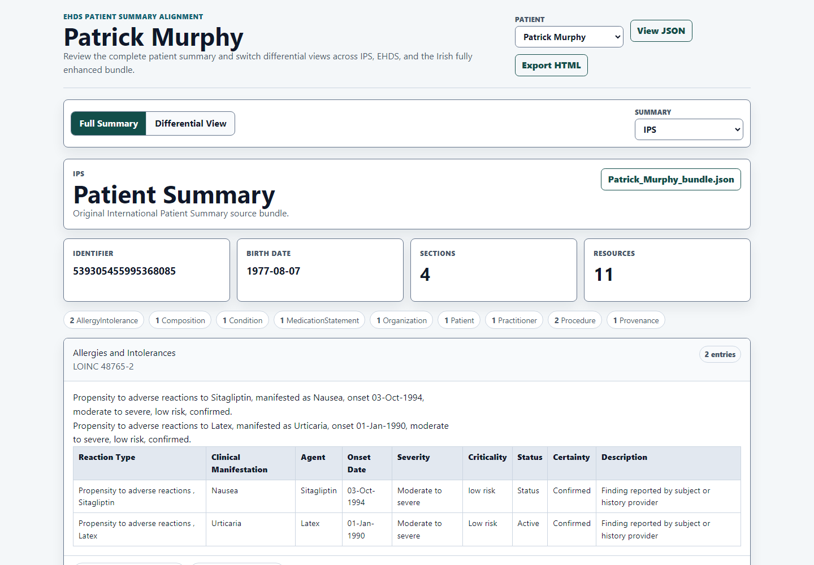
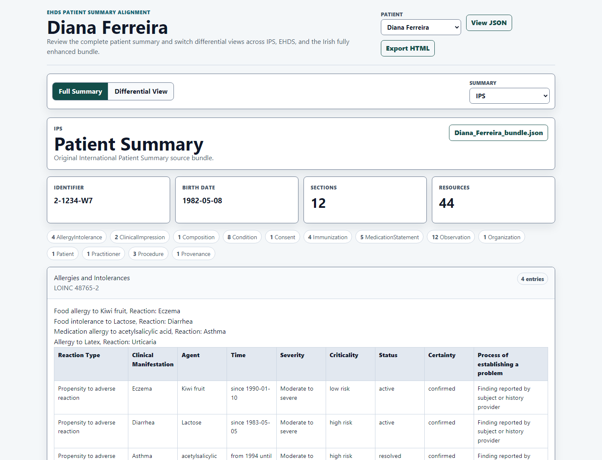
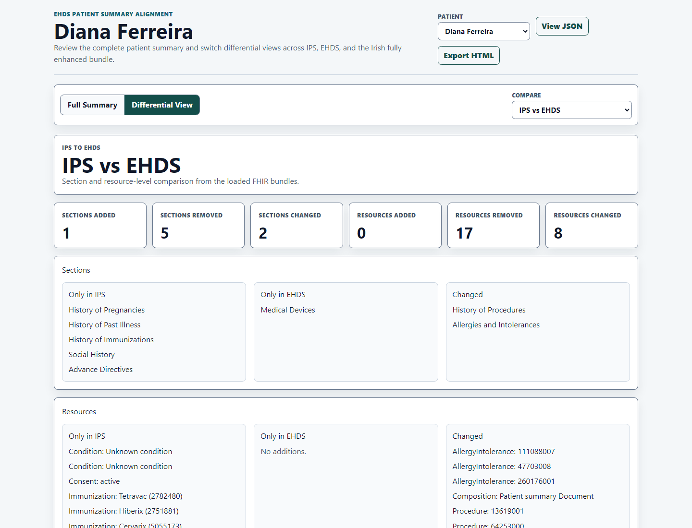
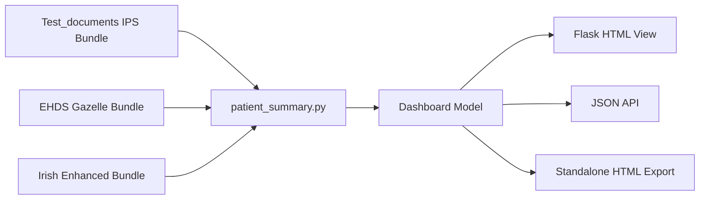
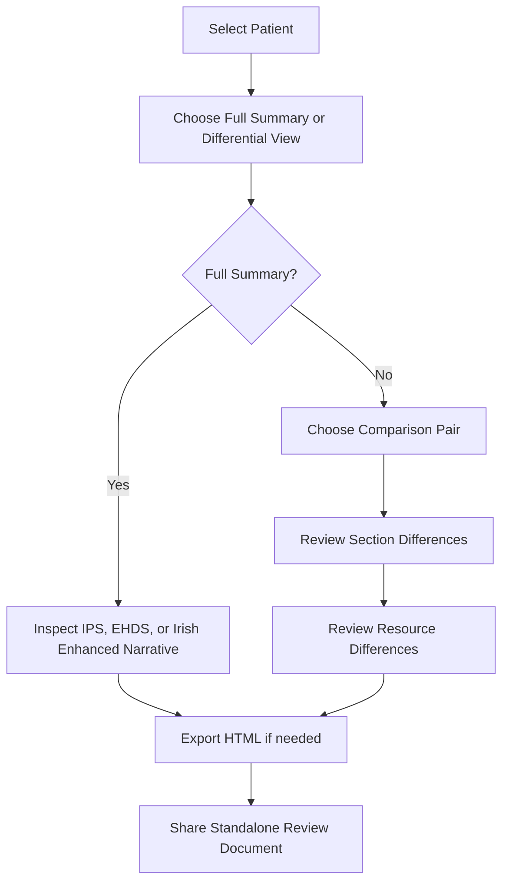
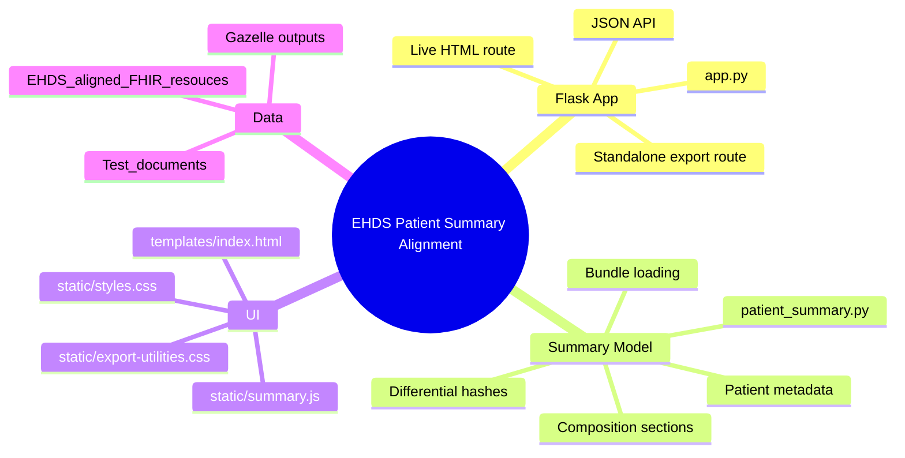

# EHDS Patient Summary Alignment

EHDS Patient Summary Alignment is a small Flask application for reviewing FHIR Patient Summary bundles as human-readable HTML. It was built to support comparison between an original IPS bundle, an EHDS/EU validator-facing bundle, and an Irish fully enhanced EHDS-aligned bundle.

The application helps reviewers answer two practical questions:

- What does the complete patient summary look like in a browser?
- What changed between IPS, EHDS, and the Irish enhanced patient summary?

Created with AI assistance. Review patient summary content, generated differentials, and exported reports before sharing externally.

## Sample Patients

The repository includes two synthetic patient summary examples used during development and review:

- Patrick Murphy - the Irish patient summary example used to show the smaller source IPS bundle and its EHDS alignment.
- Diana Ferreira - a richer patient summary example used to demonstrate fuller section coverage and differential reporting.

## Goals

This project was created to make patient-summary alignment review easier and more transparent.

- Render full FHIR Patient Summary content in a clean HTML view.
- Preserve the FHIR Composition section narrative where available, including XHTML tables.
- Let reviewers switch between IPS, EHDS, and Irish enhanced summary variants.
- Provide differential views for:
  - IPS vs EHDS
  - IPS vs Irish Fully Enhanced
  - EHDS vs Irish Fully Enhanced
- Export a standalone interactive HTML report that can be shared without running Flask.
- Keep styling in static assets, using Tailwind CSS for the live app and embedded CSS for exports.
- Document the application flow clearly enough for another developer to review or extend it.

## Screenshots

### Irish Patient Example: Patrick Murphy



### Full Patient Summary: Diana Ferreira



### Differential View: Diana Ferreira



## How It Works

The project treats the source files as three variants of the same patient summary.

| Variant | Source |
| --- | --- |
| IPS | Original bundle in `Test_documents/` |
| EHDS | Gazelle/EU validator-facing bundle in `EHDS_aligned_FHIR_resouces/gazelle/`, falling back to the aligned bundle if needed |
| Irish Fully Enhanced | EHDS-aligned Irish enhanced bundle in `EHDS_aligned_FHIR_resouces/` |

The Flask route builds a dashboard model from those files, then renders either the live browser view or a standalone export. The comparison logic hashes sections and resources to identify added, removed, and changed items.



## Review Workflow



## Application Structure



## Key Files

- `app.py` - Flask routes for the browser view, JSON API, and interactive HTML export.
- `patient_summary.py` - FHIR bundle loading, model building, patient selection, and differential logic.
- `templates/index.html` - Tailwind-backed template for full summary and differential views.
- `static/styles.css` - Application styling.
- `static/summary.js` - Browser-side view switching used by both live and exported HTML.
- `static/export-utilities.css` - Minimal Tailwind utility subset embedded into standalone exports.
- `Test_documents/` - Original IPS source bundles.
- `EHDS_aligned_FHIR_resouces/` - EHDS-aligned and Gazelle-facing bundles.

## Running Locally

Create or activate the virtual environment, install dependencies, and run Flask:

```powershell
.\.venv\Scripts\python.exe -m pip install -r requirements.txt
.\.venv\Scripts\python.exe app.py
```

Then open:

```text
http://127.0.0.1:5000/
```

## Exporting a Standalone Report

Use the `Export HTML` button in the browser. The generated file embeds the CSS and JavaScript needed for interactive switching, so recipients can open it directly in a browser without this Flask app.

The export route is also available directly:

```text
http://127.0.0.1:5000/export/interactive?patient=diana-ferreira
```

## JSON API

The same dashboard model used by the template can be inspected as JSON:

```text
http://127.0.0.1:5000/api/summary?patient=diana-ferreira
```

## Differential Approach

The differential view compares two kinds of data:

- Composition sections: title, code, empty reason, section entries, and normalized narrative text.
- Bundle resources: keyed by `ResourceType/id`, with `meta` omitted from the hash to avoid treating packaging/profile metadata as clinical content changes.

Each comparison reports:

- Items only in the left variant.
- Items only in the right variant.
- Items present in both but changed.

This is intended as a reviewer aid, not a clinical conformance validator.

## Data and Sharing Notes

- Do not use real patient-identifiable data in public repositories or public validation services.
- Confirm example bundles are synthetic or fully anonymised before publishing screenshots or exports.
- Review standalone exports before sharing externally.
- This project supports alignment review, but formal EHDS/IPS conformance still requires validation against the selected profiles and terminology bindings.
